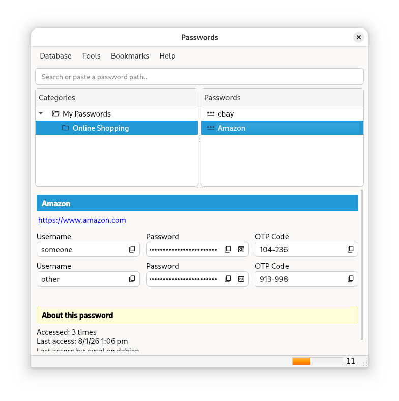
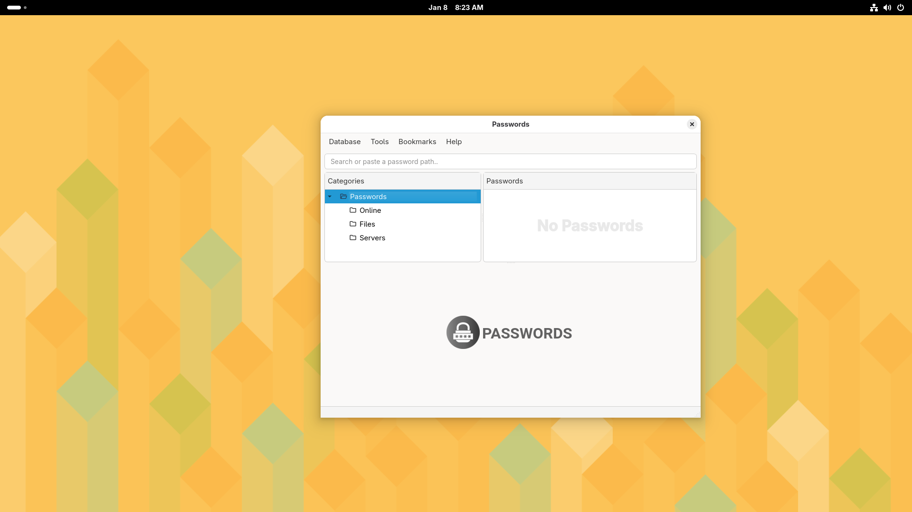
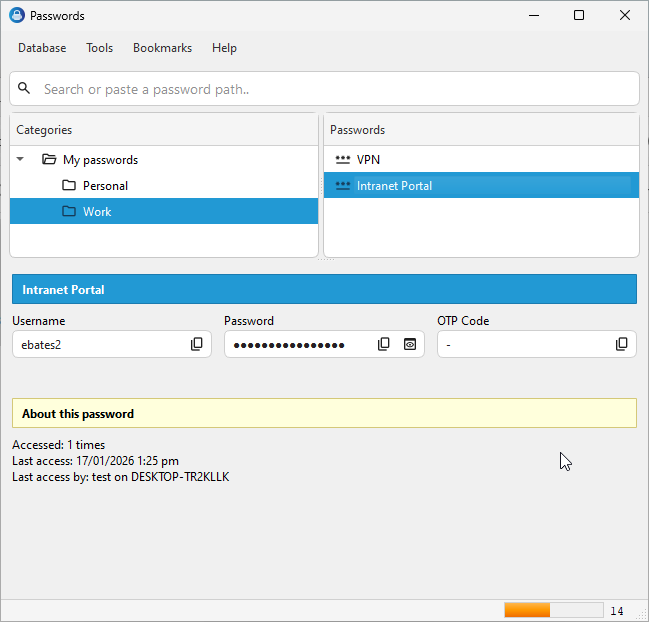
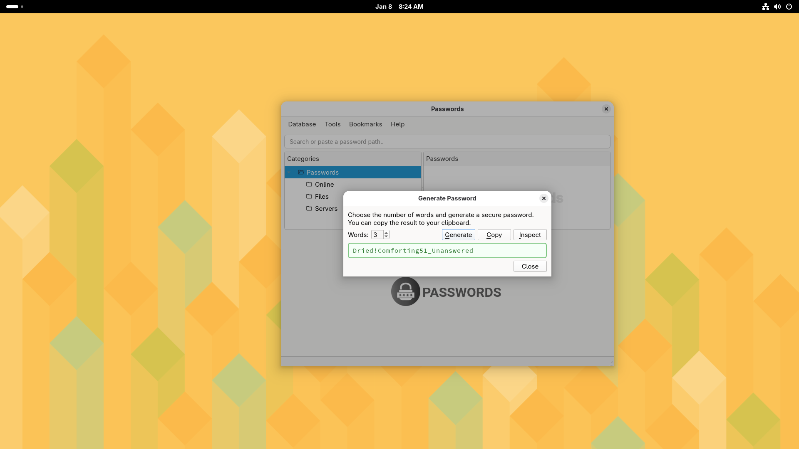
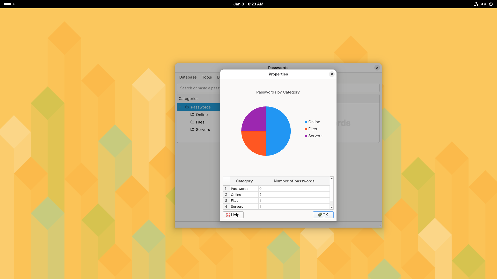
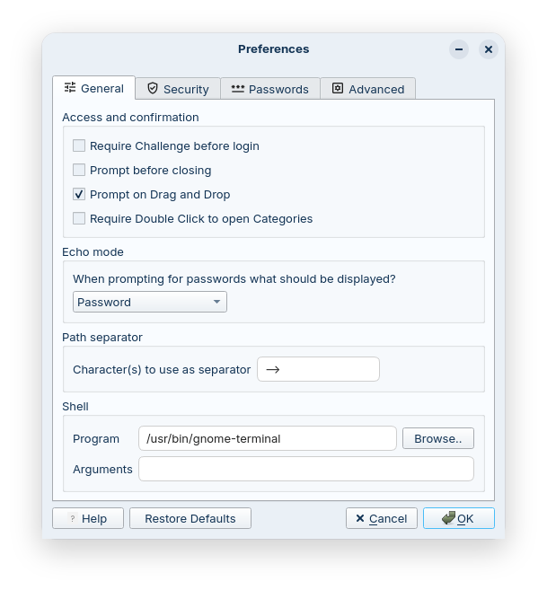

### Passwords

A free, open source, offline password manager powered by GPG.

Managing passwords securely is essential, yet many people still avoid password managers due to cost, cloud‑storage requirements, or distrust of proprietary systems. Passwords takes a different approach: it is a fully offline, cross‑platform, GPG based password manager designed for individuals, professionals, and high‑security environments.

By removing subscriptions, internet dependencies, and closed ecosystems, Passwords makes strong credential management accessible to everyone. Suitable for everyone from home users to Tier‑0/Tier‑1 enterprise environments.


#### Key Principles

- GPG‑based encryption.

- Your passwords never leave your device.  

- No cloud sync, no telemetry, no network access required.

- Fully auditable and open‑source. 

- Transparency is at the heart of this project.

- No subscriptions, no vendor lock‑in, no proprietary services.

- Cross‑platform support for Linux, macOS and Windows.

  

#### Features

- Uses GPG for strong, proven cryptography to protect private password information.
- Supports hardware‑backed keys (smartcards, YubiKeys, etc.)
- Supports multiple GPG keys for detailed segmentation of protected resources.
- Supports time‑based codes (TOTP).
- Possessing the database alone is not enough to compromise passwords — decryption requires private key(s), which can be stored on a hardware token.
- Metadata is encrypted, including entry names and structure, preventing attackers from learning anything useful even if they obtain the database.
- Cross‑platform desktop application. Supports **Linux**, **MacOS** and **Windows**.
- No proprietary dependencies. Everything used throughout this project is completely open source.
- 100% open‑source, transparent, and auditable.
- Secure by design.


#### Linux (Build from Source)

Checkout the Linux guide at https://sysal1280.github.io/passwords/en/build-linux/

You can also download a zip file or AppImage from Releases.

#### Windows

Checkout the Windows guide at https://sysal1280.github.io/passwords/en/build-windows/

You can also download a setup program from Releases.


#### Contact

The following key is provided so users, contributors, and researchers can reach out securely regarding vulnerabilities, responsible disclosure, or other sensitive matters.

If verification of the key’s authenticity is required, a brief virtual meeting or alternative verification method can be arranged. Establishing a proper trust path (“web of trust”) is important for high‑assurance communication.

```
-----BEGIN PGP PUBLIC KEY BLOCK-----

mDMEaV+hbhYJKwYBBAHaRw8BAQdAu+q2MRw1uFbHJjRo8fHfx3P6IddEZGhIpWf2
4EOIAzG0QnN5c2FsMTI4MCAoaHR0cHM6Ly9naXRodWIuY29tL3N5c2FsMTI4MC9w
YXNzd29yZHMpIDxzeXNhbEB0dXRhLmlvPoiTBBMWCgA7FiEEduAzNWhm5SbEvt3F
mWejkyFPdxMFAmlfoW4CGwMFCwkIBwICIgIGFQoJCAsCBBYCAwECHgcCF4AACgkQ
mWejkyFPdxOxsQEA813GexLfR7KiR3tTi/rTOy4Q3BnYgFFpOMSl7pVM0TcBALw9
MvveuQ+EGiZvXp0k78R7eG/SyGYApDM7CuiKOGAAuDgEaV+hbhIKKwYBBAGXVQEF
AQEHQEPtiVxJAOZJ/Y4qwZaJgJtPv51M3K5ljtFowLfMCeBvAwEIB4h4BBgWCgAg
FiEEduAzNWhm5SbEvt3FmWejkyFPdxMFAmlfoW4CGwwACgkQmWejkyFPdxOENAEA
5LDnktBg2JWencddQi5UcT1pw3n9DXhH8CQ4mhtfroIBANSjobsiMFJbkCLcbZHy
MM0F3vfXCoM5bAW6SEjJr/YC
=FKX/
-----END PGP PUBLIC KEY BLOCK-----
```


#### Screenshots












